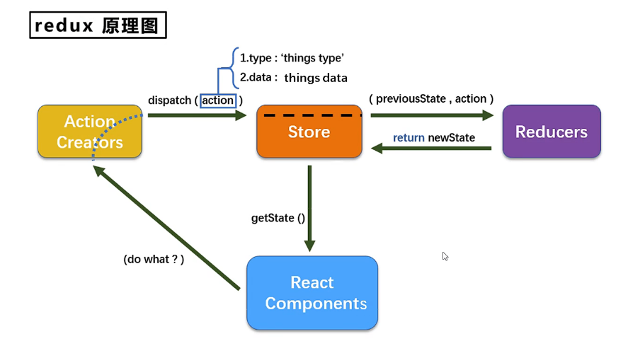
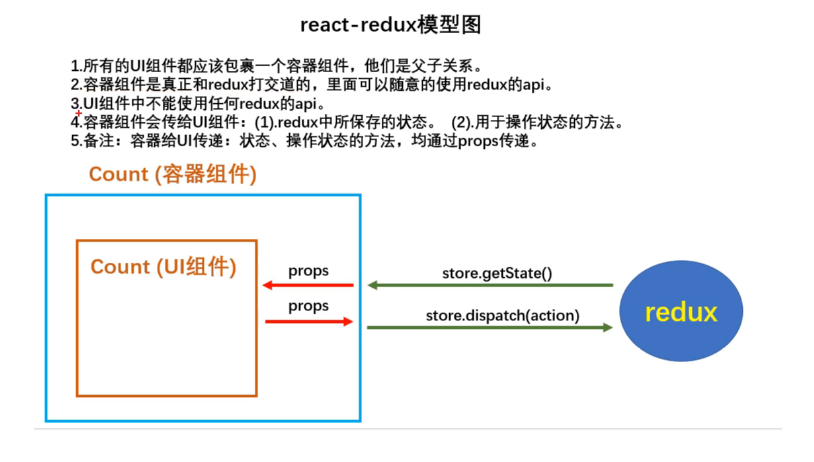
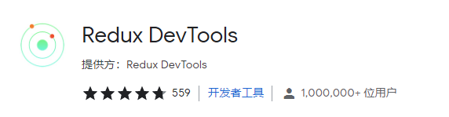

# redux



reducer的本质是一个函数，接收：preState, action，返回加工后的状态

reducer有两个作用：初始化状态，加工状态

reducer被第一次调用时，是store自动触发的，传递的preState是undefined

## redux精简版

store.js

```
import { createStore } from "redux";
import countReducer from './count_reducer'
export default createStore(countReducer)
```

count_reducer.js

```
const initState = 0
export default function countReducer(preState = initState, action) {
  const {type, data} = action
  switch (type) {
    case 'increase':
     return preState + data
    case 'decrease':
      return preState - data
    default:
      return preState
  }
}
```

Count.jsx

```
import store from '../../store/store';

store.dispatch({type: 'increase', data: this.state.selectNumber})
store.dispatch({type: 'decrease', data: this.state.selectNumber})

<h2>当前求和值为{store.getState()}</h2>

// 监测redux中状态的变化，只要变化，就调用render
store.subscribe(() => {
  this.setState({})
})
```

**redux只负责状态管理，至于状态的改变驱动页面视图的更新，要靠我们自己写。**

## react-redux



### 基本使用

1. 明确两个概念：

    * UI组件：不能使用任何redux的api，只负责页面的呈现、交互等

    * 容器组件：负责和redux通信，讲结果交给UI组件

2. 如何创建一个容器组件  --  靠react-redux的connect函数

```
connect(mapStateToProps, mapDispatchToProps)（UI组件）
-mapStateToProps:映射状态，返回值是一个对象
-mapDispatchToProps:映射操作状态的方法，返回值是一个对象
```
3. 备注1：容器组件中的store是靠props传进去的，而不是在容器组件中直接引入
4. 备注2：mapDispatchToProps也可以是一个对象，{key: value}

### 优化

1. 容器组件和UI组件整合成一个文件
2. 无需自己给容器组件传递store，给<App />包裹一个<Provider store={store}>即可
3. 使用了react-redux后再也不用自己检测redux中状态的改变了，容器组件可以自动完成这个工作
4. mapDispatchToProps也可以简单的写成一个对象
5. 一个组件要和redux“打交道”要经过哪几步？

    * 定义好UI组件  -- 不暴露
    * 引入connect生成一个容器组件，并暴露，写法如下：
    ```
    connect(
    state => ({key: value}), // 映射状态
    {key: xxxAction} // 映射操作状态的方法
    )(UI组件)
    ```
    * 在UI组件中通过this.props.xxx读取和操作状态

### 多个组件数据共享

多个组件的reducer要是用combineReducers进行合并，合并后的总状态是一个对象

交给store的是总reducer，通过key在总store中取出不同的值

```
import { combineReducers } from "redux";
combineReducers({count: countReducer})
state.count取值
```

## react-redux开发者工具的使用

1.添加浏览器扩展程序



2. 安装依赖

```
npm i redux-devtools-extension
```

3. store中进行配置

```
import {composeWithDevTools} from 'redux-devtools-extension'
const store = createStore(allReducer, composeWithDevTools(applyMiddleWare(thunk)))
或
const store = createStore(allReducer, composeWithDevTools())
```